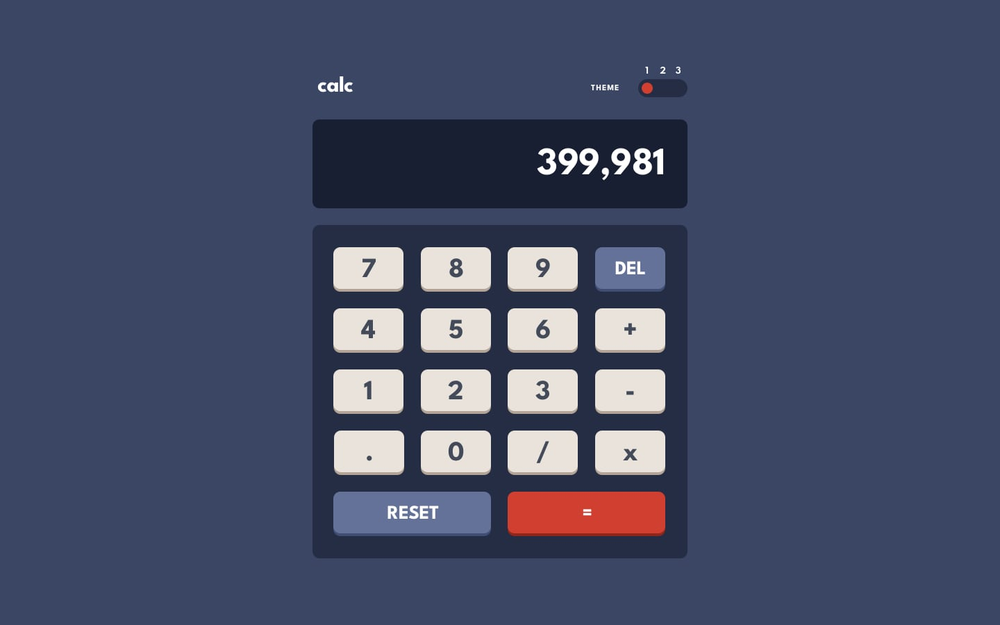

# Frontend Mentor - Calculator app

## Welcome! 👋

Thanks for checking out this front-end coding challenge.

[Frontend Mentor](https://www.frontendmentor.io) challenges help you improve your coding skills by building realistic projects.

## The challenge

Your challenge is to build out this calculator app and get it looking as close to the design as possible.

You can use any tools you like to help you complete the challenge. So if you've got something you'd like to practice, feel free to give it a go.

Your users should be able to:

- See the size of the elements adjust based on their device's screen size
- Perform mathematical operations like addition, subtraction, multiplication, and division
- Adjust the color theme based on their preference
- **Bonus**: Have their initial theme preference checked using `prefers-color-scheme` and have any additional changes saved in the browser

Want some support on the challenge? [Join our Slack community](https://www.frontendmentor.io/slack) and ask questions in the **#help** channel.

## Built with

- Astro Js
- BEM
- CSS FlexBox
- CSS Grid
- Javascript
- Fluid Typography
- Fluid Space

## What I Learned

During the development of this project, I acquired extensive knowledge about Astro, including its component utilization and workflow. Additionally, I delved deeper into CSS units, specifically exploring the merits of Container Query Units as a viable alternative to Media Queries. To gain a comprehensive understanding, you can check out this informative video on the topic: [Container Query Units](https://www.youtube.com/watch?v=ZSaAHb5dRwQ).

## Author

FrontEnd Mentor - [@renzorr](https://www.frontendmentor.io/profile/Renzorr)